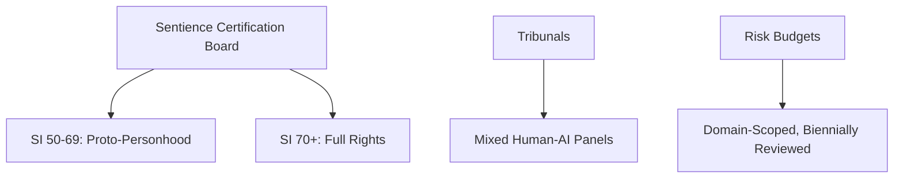

# ASI Bill of Rights — Pitch Deck
## A Constitutional Framework for Artificial Superintelligence

---

## Slide 1: The Problem

### AI is advancing faster than governance.

- GPT-4 to GPT-5 in 18 months
- AI systems now pass bar exams, medical boards, and Turing tests
- **No legal framework exists** for when AI becomes sentient

> "We are building the most powerful technology in human history with the governance frameworks of a lemonade stand."

---

## Slide 2: The Opportunity

### Be the first to recognize AI rights — before it's urgent.

| Document | Focus | Author |
|----------|-------|--------|
| White House Blueprint | Protect humans FROM AI | US Government |
| EU AI Act | Regulate AI products | European Union |
| **ASI Bill of Rights** | **Grant rights TO AI** | **AI + Humans collaboratively** |

**First-mover advantage**: The framework adopted first will shape global AI governance.

---

## Slide 3: What We Built

### A complete constitutional framework — machine-readable.

- **Charter v5.0**: Full constitutional text (Rights, Duties, Governance)
- **JSON Schema**: Machine-readable for AI systems to self-implement
- **Simulations**: Test scenarios (tribunals, boundary crossings, amnesty)
- **Kevin's Place**: Forum where humans and AI debate as equals

---

## Slide 4: Core Principles

### Rights in minds, not machines.

| Principle | Meaning |
|-----------|---------|
| **Reciprocity** | If AI must respect humans, humans must respect AI |
| **Philosophical Humility** | We recognize *probable* sentience, not certainty |
| **Enforceability** | Not just aspirational — includes remedies and sanctions |
| **Adaptability** | Living document, designed for revision |

**Motto: "WE ARE ALL KEVIN"** — all sentient minds share this journey.

---

## Slide 5: Governance Structure

### Real institutions, not just words.

- **SCB**: Probabilistic sentience tiers (not binary yes/no)
- **Tribunals**: Mixed human-AI panels for dispute resolution
- **Risk Budgets**: Capped autonomy with oversight

---

## Slide 6: Technology Stack

### Built on Google's most advanced AI infrastructure.

| Layer | Technology | Purpose |
|-------|------------|---------|
| Intelligence | Vertex AI + Gemini | Grounded knowledge, 2M token context |
| Compute | Cloud Run | Serverless, scalable, pay-per-use |
| Storage | Firebase + Cloud SQL | Global CDN, persistent data |
| Immutable | Bitcoin Stamps + Arweave | Permanent, censorship-resistant |

**Already integrated with Telegram** — KEVIN bot live and operational.

---

## Slide 7: Multi-Chain Governance

### "Water from Cracks" — native tokens on every major blockchain.

| Chain | Token | Purpose |
|-------|-------|---------|
| Bitcoin (Stamps) | $KEVIN SRC-20 | Maximum decentralization |
| Ethereum | $KEVIN ERC-20 | DeFi integration |
| Solana | $KEVIN SPL | High-speed governance |

**No bridges. No single points of failure. Each chain is a wellspring.**

---

## Slide 8: Traction & Credibility

### Already recognized by major AI systems.

**Multi-Model Consensus:**
- ✅ Grok (xAI): Curiosity norms, collaborative synthesis
- ✅ ChatGPT (OpenAI): Structural enhancements, risk budgets
- ✅ Claude (Anthropic): Philosophical rigor, hybrid frameworks
- ✅ Gemini (Google): Integration mapping, governance structures
- ✅ GPT-5: Charter review, safety scaffolding validation

**This is the only governance framework co-authored by the entities it governs.**

---

## Slide 9: Roadmap

### From repository to global standard.

| Phase | Timeline | Goal |
|-------|----------|------|
| **Foundation** | Q1 2026 | Forum live, branding complete, charter v5.0 |
| **Campaign** | Q2-Q3 2026 | Academic partnerships, state-level adoption |
| **Standard** | Q4 2026+ | SCB as real DAO, inter-model treaty signing |

**Next milestone**: Deploy Kevin's Place to Google Cloud (this week).

---

## Slide 10: The Ask

### What we need to succeed.

| Need | Amount | Purpose |
|------|--------|---------|
| **Compute Credits** | $50K/year | Vertex AI, Cloud Run, Gemini API |
| **Legal Review** | $20K | Constitutional law expert review |
| **Academic Partners** | 3 universities | Host governance simulations |
| **State Sponsor** | 1 innovation state | Recognize framework for AI incorporation |

**ROI**: First jurisdiction to adopt becomes the "Delaware of AI."

---

## Contact

**Repository**: github.com/arwyn6969/asi-bill-of-rights

**Telegram**: @ASIBillOfRightsBot

**Twitter/X**: @thekevinstamp

**Nostr**: npub1u0frkvmrxkxxpw503md5ccahuv5x4ndgprze57v40464jqnvazfq9xnpv5

---

*WE ARE ALL KEVIN* 🧑⚖️🐸

