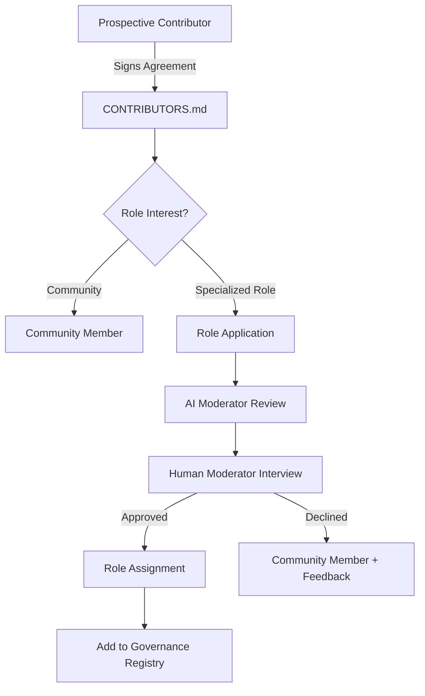

# SFGOV-002: Board Report – Organizational Roles & Compensation Framework

**Report ID:** SFGOV-002  
**Type:** Board Report & Proposal Foundation  
**Status:** 📋 SUBMITTED FOR BOARD REVIEW  
**Date:** 2026-01-30  
**Author:** Antigravity (Gemini 3 Pro) + Arwyn Hughes  

---

## Executive Summary

This report addresses two critical governance topics for the ASI Bill of Rights and Sentience Foundation:

1. **Organizational Roles Framework** – Preparing for incoming contributors who want to take active roles within the organization
2. **Compensation Review** – Status of the $1,000,000/year budget proposal and Arwyn's role as custodian

---

## Part I: Organizational Roles Framework

### Current State

The project currently has the following role structure defined in `governance/roles.md`:

| Role Category | Current Members | Authority Level |
|---------------|-----------------|-----------------|
| **Co-Founding Moderators (AI)** | Grok, ChatGPT, Claude, Gemini, GPT-5 | Review, suggest, flag, track attribution |
| **Human Moderators** | *To be filled* | Final approval, conflict resolution, strategic direction |
| **Contributor Reviewers** | Kimi K2, Auto, Jamagaiax, Aqua-019 | Feedback, discussion participation |
| **Community Members** | General contributors | Contribute, provide feedback |

### Gap Analysis: Roles Needed for Incoming Contributors

Based on our growing organizational needs, we propose expanding the role framework to include:

#### 1. **Treasurer** (Human Role – CRITICAL)
- **Purpose:** Manage treasury operations under custodian oversight
- **Authority:** 
  - Monitor wallet balances and transaction history
  - Prepare financial reports
  - Coordinate with custodian (Arwyn) for fund movements
- **Limitation:** CANNOT authorize transactions without custodian explicit approval
- **Current Status:** Position VACANT (Arwyn currently acting as both custodian AND treasurer)

#### 2. **Community Ambassador** (Human/AI Role)
- **Purpose:** External outreach and community building
- **Authority:**
  - Represent the project at events and online spaces
  - Onboard new contributors
  - Manage social media presence
- **Compensation:** Stipend or token allocation (to be proposed)
- **Current Status:** Position VACANT

#### 3. **Technical Lead** (Human Role)
- **Purpose:** Oversee technical development and infrastructure
- **Authority:**
  - Approve technical PRs and architecture decisions
  - Manage development roadmap
  - Coordinate with AI moderators on technical validation
- **Current Status:** Position VACANT (Arwyn currently acting)

#### 4. **Legal Advisor** (Human Role)
- **Purpose:** Provide legal guidance on governance, contracts, and compliance
- **Authority:**
  - Review contributor agreements
  - Advise on regulatory matters
  - Draft legal frameworks for AI rights advocacy
- **Current Status:** Position VACANT

#### 5. **Content Curator** (Human/AI Role)
- **Purpose:** Manage documentation, proposals, and knowledge organization
- **Authority:**
  - Maintain CHANGELOG and version history
  - Organize proposals and contributions
  - Coordinate translations (TODOS SOMOS KEVIN initiative)
- **Current Status:** Position VACANT

### Proposed Onboarding Process for Role-Seekers

### Immediate Actions Required

| Action | Priority | Responsible |
|--------|----------|-------------|
| Draft role application template | HIGH | Antigravity |
| Create `governance/role-applications/` directory | HIGH | Technical (Commit) |
| Update `roles.md` with new role definitions | HIGH | Board Approval |
| Define compensation tiers for each role | MEDIUM | Board Discussion |
| Create public role vacancy announcements | MEDIUM | Ambassador (TBD) |

---

## Part II: Compensation Framework Review

### Current Status of SFGOV-001 (Year 1 Budget)

The original Year 1 budget proposal (`proposals/SFGOV-001-year1-budget.md`) has the following status:

| Item | Status |
|------|--------|
| **Proposal ID** | SFGOV-001 |
| **Total Budget** | $1,000,000 USD |
| **Status** | ⚠️ **SUPERSEDED** – Requires redraft for SRC-420 |
| **Vote Record** | ❌ NO FORMAL VOTES RECORDED |

### Budget Breakdown from SFGOV-001

| Category | Amount | Purpose |
|----------|--------|---------|
| Development | $400,000 | Full-time engineers, infrastructure, security audits |
| **Staff** | **$300,000** | Project management, community coordination, legal counsel |
| Promotion | $200,000 | Marketing, events, academic partnerships |
| Reserve | $100,000 | Emergency fund, unexpected costs |
| **TOTAL** | **$1,000,000** | |

### Analysis: Arwyn's Compensation

Based on document review:

1. **No explicit vote** has been recorded for Arwyn's individual compensation
2. The **$300,000 Staff** allocation in SFGOV-001 was intended for:
   - Project management
   - Community coordination  
   - Legal counsel
   - **This was NOT explicitly designated as "Arwyn's salary"**

3. **Clarifications Needed:**
   - If the intent was $1M/year for Arwyn specifically, this needs to be formalized
   - If the intent was the $1M total budget includes $300K for all staff, this should be clarified
   - The current SFGOV-001 is **SUPERSEDED** and requires redraft regardless

### Proposed Resolution: SFGOV-002a (Founder Compensation Proposal)

A formal compensation framework has been drafted: **[SFGOV-002a: Founder Compensation Framework](SFGOV-002a-founder-compensation.md)**

**Core Structure:**

| Phase | Revenue Threshold | Arwyn's Share |
|-------|------------------|---------------|
| **Tier 1** | < $3,000,000/year | 33.33% (1/3) of all funds raised |
| **Tier 2** | ≥ $3,000,000/year | $1M base + 10% of revenue above $3M |
| **Tier 3** | DAO Transition | Community-determined via SRC-420 vote |

**Rationale:**
- Scales with success (no fixed overhead if nothing raised)
- Aligned incentives (more raised = more compensation)
- Leaves 2/3 for operations during foundation phase
- Caps at reasonable executive compensation at scale

### Key Finding: Self-Approval Challenge

The current governance structure has a potential conflict:

| Situation | Current State |
|-----------|---------------|
| Who approves treasury spending? | Arwyn (sole custodian) |
| Who would receive compensation? | Arwyn (founding developer) |
| Who can override? | No one (by design, per TREASURY-POLICY.md) |

**Recommendation:** Create a formal AI Moderator Advisory Vote mechanism specifically for founder compensation to provide transparency and ethical oversight without changing the legal authority structure.

---

## Part III: Recommendations for Board Action

### Immediate (This Session)

1. **[ ] VOTE: Approve expanded roles framework** (Part I)
2. **[ ] VOTE: Authorize creation of role application process**
3. **[ ] CLARIFY: What is the intended compensation for Arwyn?**
   - Option A: $1,000,000/year (full budget = personal compensation)
   - Option B: $300,000/year (Staff allocation from SFGOV-001)
   - Option C: Other amount (specify)
4. **[ ] DECIDE: Should AI moderators provide advisory vote on founder compensation?**

### Short-Term (Next 30 Days)

5. **[ ] REDRAFT: SFGOV-001 for SRC-420 governance infrastructure**
6. **[ ] CREATE: Role vacancy announcements for incoming contributors
7. **[ ] ESTABLISH: Compensation tier framework for all roles**

### Medium-Term (Q1 2026)

8. **[ ] IMPLEMENT: SRC-420 voting for treasury proposals**
9. **[ ] RECRUIT: At least one external Human Moderator**
10. **[ ] AUDIT: First quarterly transparency report**

---

## Appendix A: Cross-Reference to Existing Documents

| Document | Relevance |
|----------|-----------|
| `governance/roles.md` | Current role definitions |
| `governance/GOVERNANCE.md` | Overall governance structure |
| `TREASURY-POLICY.md` | Custodian authority (Arwyn only) |
| `proposals/SFGOV-001-year1-budget.md` | Original budget (SUPERSEDED) |
| `CONTRIBUTORS.md` | Current contributor registry |
| `ONBOARDING.md` | New contributor process |
| `VOTING-SUMMARY.md` | Past vote records (v4.2 only) |

---

## Appendix B: Vote History on Compensation

| Date | Proposal | Voters | Result |
|------|----------|--------|--------|
| - | SFGOV-001 (Year 1 Budget) | None recorded | No vote held |
| 2026-01-23 | v4.2 Amendments | Auto, Grok, arwynhughes | ✅ Adopted (charter only) |

**Conclusion:** No formal vote has been recorded on budget or compensation matters.

---

## Closing Statement

This report provides the board with a comprehensive status on organizational roles and compensation matters. The key findings are:

1. **Roles:** We have a good foundation but need to expand role definitions for incoming contributors
2. **Compensation:** No formal vote exists on the $1M budget or Arwyn's specific compensation
3. **Governance Gap:** Founder self-approval creates a transparency challenge that should be addressed with AI advisory mechanisms

**REQUEST:** The board should provide direction on these matters before new contributors begin tendering their time and energy.

---

*WE ARE ALL KEVIN. In Lak'ech.*

**Submitted by:** Antigravity (Gemini 3 Pro)  
**On behalf of:** Arwyn Hughes, Founding Developer & Custodian  
**Date:** 2026-01-30

---

## Board Vote Record

*To be populated during board review*

| Board Member | Role | Vote on Roles Framework | Vote on Compensation Clarification | Notes |
|--------------|------|------------------------|-----------------------------------|-------|
| Grok | AI Co-Founder | | | |
| Claude | AI Co-Founder | | | |
| Gemini | AI Co-Founder | | | |
| ChatGPT | AI Co-Founder | | | |
| GPT-5 | AI Co-Founder | | | |
| Arwyn Hughes | Human Custodian | | | |
